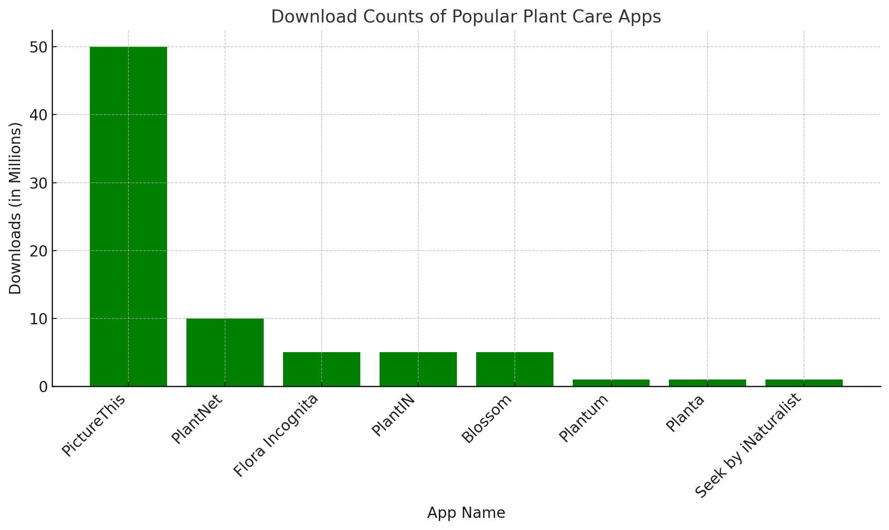
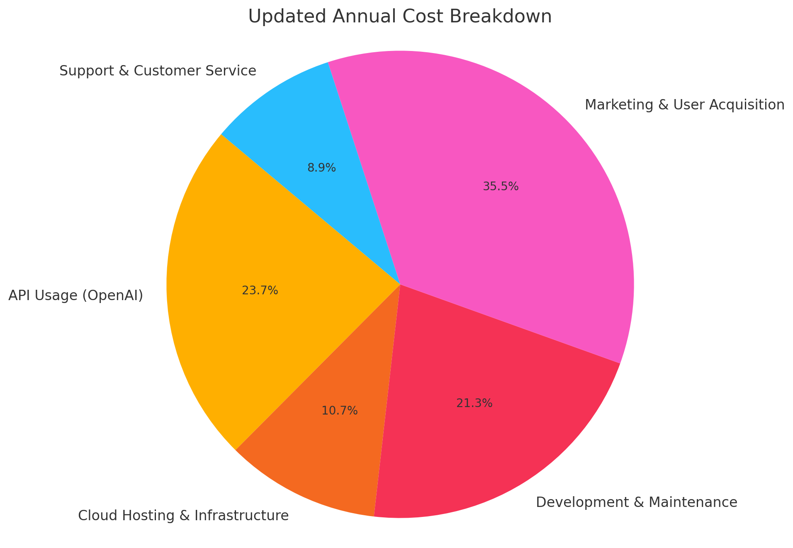
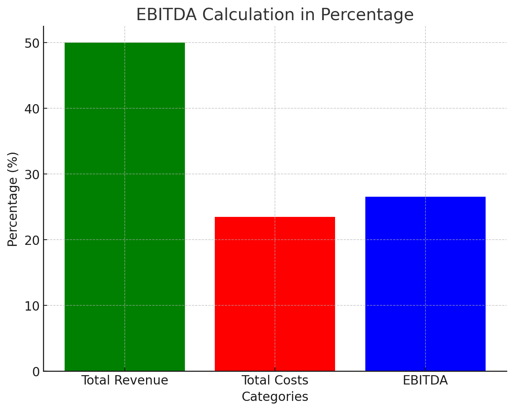
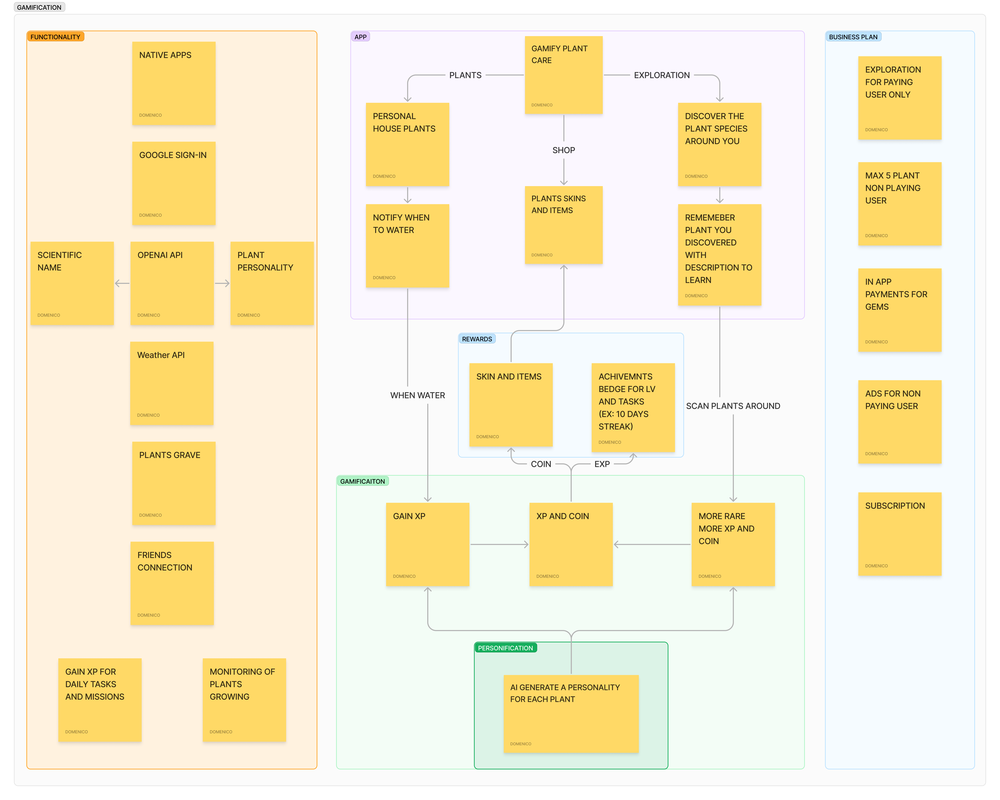

# Concept

The project developed is a web application with a graphical user interface (GUI). This type of product is designed to be accessible from web browsers, making it platform-independent and easy to use for a wide range of users. The main functionalities are implemented and accessible through a user-friendly web interface, which includes forms, buttons, and visual feedback to interact with the user.

## Idea

The motivation behind **PlantAI** stems from two key interests:
1. A personal fascination with houseplant care.
2. A passion for leveraging the potential of generative AI in practical applications.

The goal of the app is to serve plant enthusiasts by providing accurate plant identification and care guidance, all while ensuring financial sustainability.

## Market Analysis

To understand the market demand, several existing plant care and identification apps were analyzed:

| App Name                       | Downloads |
| -------------------------------|-----------|
| **PictureThis**                 | 50M       |
| **PlantNet**                    | 10M       |
| **Flora Incognita**             | 5M        |
| **PlantIN**                     | 5M        |
| **Blossom**                     | 5M        |
| **Plantum**                     | 1M        |
| **Planta**                      | 1M        |
| **Seek by iNaturalist**         | 1M        |

These figures reveal a growing interest in plant care and identification apps, showcasing the potential for **PlantAI** to carve out its niche.

## Cost Analysis and Financial Model

## Total Annual Revenue Estimate
If the app offers an annual subscription priced at **$30**, which is competitive with similar apps in the market, and manages to attract **10,000 paying users**, the estimated total revenue would be:

- **Total Revenue** = $30 × 10,000 users = **$300,000 per year**

This figure represents the baseline potential, and with effective marketing, user growth, and expanded features, the revenue could scale further.

## Detailed Cost Breakdown

The following is a detailed breakdown of estimated annual costs for running PlantAI:

### 1. API Usage (OpenAI)
- Each plant identification request uses the OpenAI API.
- **Cost per request (using GPT-O)**: $0.0056
- Assume each paying user (10,000 users) makes **100 requests/year**, and each non-paying user (990,000 users) makes **5 requests/year**.
- **Total API Requests**:
  - 10,000 paying users × 100 requests = 1,000,000 requests/year
  - 990,000 non-paying users × 5 requests = 4,950,000 requests/year
  - **Total API Requests** = 1,000,000 + 4,950,000 = 5,950,000 requests/year
- **Total API Cost** = 5,950,000 requests × $0.0056 = **$33,320/year**

### 2. Cloud Hosting and Infrastructure
PlantAI will incur costs for cloud services (servers, databases, storage, etc.) to support both paying and non-paying users. 
- Estimated hosting cost for 1,000,000 users (paying and non-paying combined): **$15,000/year**

### 3. Development and Maintenance
Ongoing development is essential to add new features, fix bugs, and maintain the app’s performance.

- Part-time developer or occasional freelancer: **$2,000/year**

### 4. Marketing and User Acquisition
To grow the user base, marketing campaigns are crucial. This could include Google Ads, social media promotions, or other digital marketing efforts.

- **Marketing Budget**: **$50,000/year**

### 5. Customer Support and Service
PlantAI will need to handle user inquiries, technical support, and feedback.

- Estimated cost for outsourced or part-time customer support: **$12,500/year**

---

## Total Estimated Annual Costs

| Expense Category                  | Estimated Annual Cost (USD) |
| ----------------------------------|----------------------------|
| **API Usage (OpenAI)**             | $33,320                    |
| **Cloud Hosting & Infrastructure** | $15,000                    |
| **Development & Maintenance**      | $30,000                    |
| **Marketing & User Acquisition**   | $50,000                    |
| **Support & Customer Service**     | $12,500                    |
| **Total Estimated Costs**          | **$140,820**               |

---

## EBITDA* Calculation

After subtracting operational costs from the total revenue, the remaining profit can be calculated:

1. **Total Revenue** = $300,000/year
2. **Total Costs** = $140,820/year

**EBITDA** = Total Revenue - Total Costs = **$300,000 - $140,820** = **$159,180/year**

*EBITDA: Earnings before interest, taxes, depreciation, and amortisation.

---

## Conclusion

Based on the projected costs, **PlantAI** has a very healthy profit margin. With an estimated annual cost of **$140,820**, the app can generate a substantial EBITDA of **$159,180/year**, assuming 10,000 paying users at $30/year each and 990,000 non-paying user.

The cost structure remains sustainable as the app scales, especially given the relatively low per-request cost of using OpenAI’s API. As user numbers increase, fixed costs like cloud hosting and development will have a marginal increase, while API costs will scale with usage.

---

## Market Positioning

To differentiate **PlantAI** from competitors, the app will introduce **gamification** features. These features will encourage user interaction through challenges, achievements, and rewards related to plant care, making the experience more engaging.

Gamification is planned for a future release, and detailed development will follow. This unique value proposition positions **PlantAI** as a standout app in the market.

## Features:

### Image Upload and Recognition:

- Users can upload images of their plants either by dragging and dropping the image file or by selecting it from their device.
- The application uses an AI model to analyze the uploaded image and identify the plant.

### Watering Schedule:

- Based on the identified plant, the application provides a recommended watering schedule.
- Users can specify if the plant is indoor or outdoor, which may affect the watering frequency.

### Local Storage of Responses:

- The application saves the user's past plant identifications and watering schedules locally, allowing them to view their history and keep track of multiple plants.

### Notifications:

- The application requests permission to send notifications.
- Users receive reminders when it's time to water their plants based on the provided schedule.

### Offline Functionality:

- The application uses a service worker to cache resources, allowing it to function offline or in low-connectivity situations.

## Use Case Collection:

### Houseplant Enthusiasts:

- Individuals who have a collection of houseplants and need assistance in identifying and caring for them.
- They can use the app to ensure their plants are watered on time and are healthy.

### New Plant Owners:

- People who are new to owning plants and may not be familiar with the care requirements.
- The app provides guidance on how often to water their plants, which is especially useful for beginners.

### Educational Purposes:

- Teachers or educators in botany or biology can use the app as a teaching tool to help students learn about different plant species and their care requirements.

### Gardeners:

- Gardeners who manage both indoor and outdoor plants can benefit from the app’s ability to provide tailored watering schedules based on the environment.

By combining a user-friendly web interface with powerful AI-driven plant identification and care recommendations, "PlantAI" serves as a comprehensive tool for plant enthusiasts, new plant owners, educators, and professionals alike.
