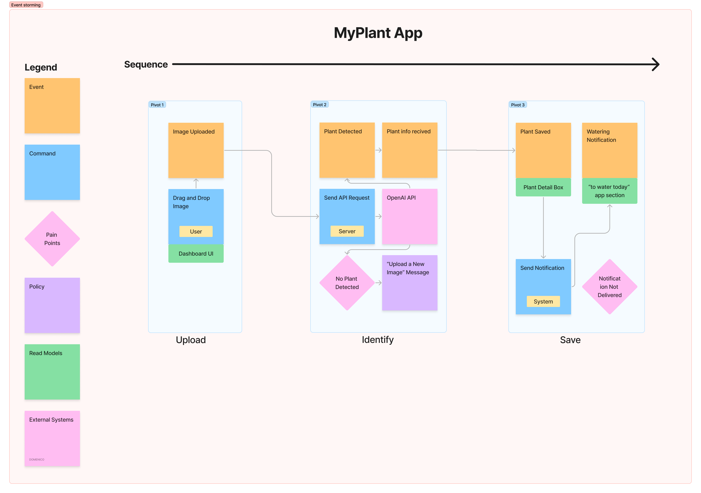

# Design

## Architecture
The architecture of "PlantAI" follows a **layered architecture**, ensuring modularity and maintainability. The key layers include:

1. **Presentation Layer**: Handles the user interface using HTML, CSS, and JavaScript. Manages user interactions and communicates with the backend via HTTP requests.
2. **Business Logic Layer**: Built with Express.js, this layer processes user requests, applies business rules, and coordinates interactions between other layers.
3. **Data Access Layer**: Manages data storage and retrieval. Local storage is used for caching responses on the client, while Multer handles image uploads on the server.
4. **Service Layer**: Interfaces with external services like the OpenAI API to perform plant identification.

## Backend

The backend of PlantAI is built using Node.js and Express, enabling efficient handling of image uploads and API interactions. Key technical components include:

### 1. Image Uploads
Multer middleware is used for handling image uploads in memory, allowing for immediate processing of files without disk storage.

### 2. OpenAI API Integration
The backend communicates with the OpenAI API to analyze plant images and extract relevant details. The image is converted to base64 and sent as part of a request to the API, which responds with plant information or a "not a plant" notification.

### 3. Error Handling
The backend includes error handling to manage cases like missing images or invalid responses from the API, ensuring a reliable user experience.

### 4. Response Handling
The backend processes the API response, ensures data is correctly formatted, and sends it back to the frontend as a JSON object.

### 5. Endpoint and POST Request
The backend exposes an endpoint `/submit` that accepts POST requests. This endpoint is responsible for handling image uploads and processing the request.

- **URL**: `/submit`
- **Method**: POST
- **Request Body**: Contains the uploaded image and the plant’s location (indoor/outdoor).
- **Response**: A JSON object with the plant's identification details, watering schedule, or a "not a plant" message.

## Interaction
When a user uploads an image, the system follows this flow:
1. The image is uploaded via the frontend.
2. A request is made to the backend to process the image.
3. The backend sends the image to the OpenAI API for identification.
4. Once a response is received, the plant data is displayed to the user, and past responses are stored locally.

## Behaviour
The system transitions through the following states:
1. **Initial State**: No image uploaded.
2. **Processing**: After an image is uploaded and is being analyzed.
3. **Result Displayed**: After a successful plant identification.
4. **Error State**: If the system fails to identify a plant or encounters an error.

## Data-related Aspects
The application uses **Local Storage** for caching user data and responses, ensuring offline access. **Multer** is employed to handle image uploads on the server, and these images are sent to the OpenAI API for plant identification.

## Domain-driven Design (DDD)
The PlantAI application is centered around the domain of plant identification and management. Its primary focus is to help users identify plants through image uploads and provide care instructions. Here’s a brief breakdown based on Domain-Driven Design (DDD) principles:

### Domain
The application's domain revolves around plant care, specifically identifying plants and managing their watering schedules. The target audience includes plant enthusiasts who want to identify plants or receive reminders to care for their plants.

### Core Entities and Aggregates
- **Plant**: The main aggregate, which contains information such as the plant’s common name, scientific name, watering schedule, and care instructions.

### Domain Events
Key domain events include:
- **Image Uploaded**: A user uploads an image of a plant.
- **Plant Recognized**: The app identifies the plant using the OpenAI API.
- **Information Returned**: The app returns plant details (name, watering schedule, care instructions...).
- **Plant Saved**: A user saves the plant details to their collection.
- **Watering Notification Sent**: The app sends a notification to remind the user to water the plant.

### Commands
Primary commands executed in the domain include:
- **Upload Image**: A request to analyze the plant image.
- **Save Plant**: Save the identified plant information for future reference.
- **Send Watering Notification**: Trigger a notification for plant watering based on the saved schedule.

### External Systems
The application interacts with external systems, primarily the OpenAI API, for plant identification.

